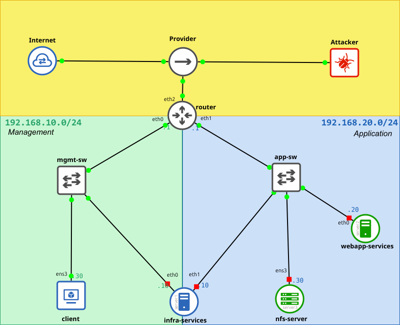
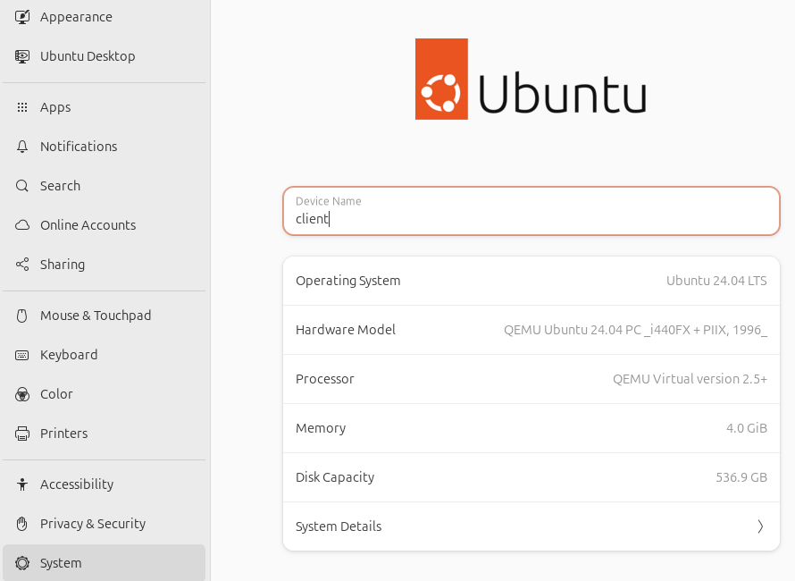
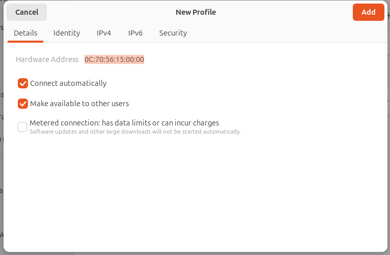

# GNS3 Lab for LFCS: Preparation

 [Back to main](GNS3 Lab for LFCS - Overview and Guidelines.md) 


## GNS3 Network Schema




## GNS3 Lab Requirements

### Required OSes Images

For each OSes in the following table, download the required files and then add the relative GNS3 template using "New Template" on the *Device Pane* of GNS3 interface:

| **OS**               | **Download Link**                                                                                                                                                                                                                                  | **GNS3 Template Type** | **Usage**                                                                                                      |
|----------------------|----------------------------------------------------------------------------------------------------------------------------------------------------------------------------------------------------------------------------------------------------|------------------------|----------------------------------------------------------------------------------------------------------------|
| Rocky Linux 8.9      | - [Qemu Image](https://dl.rockylinux.org/vault/rocky/8.9/images/x86_64/Rocky-8-GenericCloud-Base-8.9-20231119.0.x86_64.qcow2)<br>- [Cloud Init](https://github.com/GNS3/gns3-registry/raw/master/cloud-init/rocky-cloud/rocky-cloud-init-data.iso) | RockyLinux             | - username: `rocky`<br>- password: `rocky`<br>- becoming root: `sudo -i` |
| Alpine Linux 3.18.4  | - [Qemu Image](https://unlimited.dl.sourceforge.net/project/gns-3/Qemu%20Appliances/alpine-virt-3.18.4.qcow2)                                                                                                                                      | Alpine Linux Virt      | - Autologin as `root`                                                                                          |
| Ubuntu Desktop 24.04 | - [Qemu Image](https://kumisystems.dl.sourceforge.net/project/osboxes/v/vm/55-U--u/24.04/64bit.7z)                                                                                                                                                 | Ubuntu Desktop Guest   | - username: `osboxes`<br>- password: `osboxes.org`<br>- becoming root: `sudo -i` |
| Ubuntu Server 20.04  | - [Qemu Image](https://cloud-images.ubuntu.com/releases/24.04/release/ubuntu-24.04-server-cloudimg-amd64.img)<br>- [Cloud Init](https://github.com/GNS3/gns3-registry/raw/master/cloud-init/ubuntu-cloud/ubuntu-cloud-init-data.iso)               | Ubuntu Cloud Guest     | - username: `ubuntu`<br>- password: `ubuntu`<br>- becoming root: `sudo -i` |

## Lab Preparation

The following table contains all of the required node to set the GNS3. Follow the schema and place each node in the GNS3 Workspace.

> [!IMPORTANT]
> The interface names may differ from those showed on the schema. For example, an interface shown as `eth0` in GNS3 might appear as `ens0` or similar. When connecting devices, always refer to the interface number rather than the name for accuracy.

### GNS3 Nodes

| **Node**          | **Section** | **GNS3 Template**        | **Role**                                                                                                       |
|-------------------|-------------|--------------------------|----------------------------------------------------------------------------------------------------------------|
| `internet`        | End Device  | NAT Cloud Node           | Provides internet connectivity.                                                                                |
| `provider`        | Switches    | HUB Node                 | Three ports Hub that simulate the provider Interface, allowing to attach a client simulating a malicious user. |
| `attacker`        | End Device  | Alpine Linux Virt 3.18.4 | This system is used to test network security and as GIT repository.                                            |
| `router`          | End Device  | Rocky Linux 8.9          | Routing between subnets, NAT, firewall.                                                                        |
| `infra-services`  | End Device  | Rocky Linux 8.9          | Infrastructure management, storage, user authentication, load-balancing.                                       |
| `webapp-services` | End Device  | Ubuntu Server 20.04      | Hosting web applications.                                                                                      |
| `nfs-server`      | End Device  | Rocky Linux 8.9          | NFS storage, backup services, LVM storage, docker.                                                             |
| `client`          | End Device  | Ubuntu Desktop 24.04     | Client system                                                                                                  |
| `mgmt-sw`         | Switches    | Ethernet Switch          | Four ports switch that provides connectivity to the management subnet devices.                                 |
| `app-sw`          | Switches    | Ethernet Switch          | Four ports switch that provides connectivity to the application subnet devices.                                |

### GNS3 End-System Hardware configuration

Use GNS configuration pane for each system to set required hardware resources:

- additional disks should use the `virtio` driver interface.
- additional interface should use the `virtio-net-pci` paravirtualized driver interface


| **Node**          | **CPU** | **RAM**   | **Disk** (all images are thin provisioned)                                                               | **Network**                                                                                                                              |
|-------------------|---------|-----------|----------------------------------------------------------------------------------------------------------|------------------------------------------------------------------------------------------------------------------------------------------|
| `attacker`        | `1`     | `512 MiB` | - `/dev/sda`: `1 GiB` (Primary disk for OS)                                                              | - `eth0`: DHCP from GNS3 NAT node                                                                                                        |
| `router`          | `1`     | `1 GiB`   | - `/dev/vda`: `10 GiB` (Primary disk for OS)                                                             | - `eth0`: `192.168.10.1/24` (Management Subnet)<br>- `eth1`: `192.168.20.1/24` (Application Subnet)<br>- `eth2`: DHCP from GNS3 NAT node |
| `infra-services`  | `1`     | `1 GiB`   | - `/dev/vda`: `10 GiB` (Primary disk for OS)<br>- `/dev/vdb`: `30 GiB` (Additional disk for LVM storage) | - `eth0`: `192.168.10.10/24` (Management Subnet)<br>- `eth1`: `192.168.20.10/24` (Application Subnet)                                    |
| `webapp-services` | `1`     | `1 GiB`   | - `/dev/vda`: `10 GiB` (Primary disk for OS)                                                             | - `eth0`: `192.168.20.20/24` (Application Subnet)                                                                                        |
| `nfs-server`      | `1`     | `1 GiB`   | - `/dev/vda`: `10 GB` (Primary disk for OS)<br>- `/dev/vdb`: `30 GB` (NFS storage)                       | - eth0: `192.168.20.30/24` (Application Subnet)                                                                                          |
| `client`          | `1`     | `4 GiB`   | - `/dev/vda`: `500 GiB`                                                                                  | - `ens3`: `192.168.10.30/24` (Management Subnet)                                                                                         |
## GNS3 Appliances Configuration 

When GNS Lab starts all systems (Appliances) except the `router` and the `attacker` systems are not connect to Internet. On such systems packages installation and upgrades are not needed they are part of the Task of the Lab, after the `router` is properly set.

> [!NOTE]
> GNS3 terminal open a `telnet` session on the system that use by default `80` columns and `25` rows. Once logged it is possibile to adapt this to the size of the graphical terminal window using the command **`stty rows {#rows} columns {#columns}`**.

### Attacker (`attacker`)

#### Base config

```
hostname attacker
echo "attacker" | tee  /etc/hostname
```
#### Network configuration

1. Get the IPv4 configuration from GNS3 DHCP server:
    ```bash
    udhcpc eth0
    setup-interfaces -a
    ```

2. Fix the IP address of the system by creating an `/etc/network/interfaces` file with the actual configuration. To do this, launch the `setup-interfaces` command. This is an interactive application please confirm all of the proposed values, please note IP address can be different from the one in the following example:

    ```bash
    setup-interfaces

    # Output
    # Confirm all of the proposed values
    Which one do you want to initialize? (or '?' or 'done') [eth0] 
    # The proposed IP address can be different
    Ip address for eth0? (or 'dhcp', 'none', '?') [192.168.122.116] 
    Netmask? [255.255.255.0] 
    Gateway? (or 'none') [192.168.122.1] 
    Configuration for eth0:
      type=static
      address=192.168.122.116
      netmask=255.255.255.0
      gateway=192.168.122.1

    # Respond no
    Do you want to do any manual network configuration? (y/n) [n]
    ```

3. Check the `/etc/network/interfaces` file. It should look like this:

    ```bash
    cat /etc/network/interfaces
    
    # Output
    auto lo
    iface lo inet loopback

    auto eth0
    iface eth0 inet static
        address 192.168.122.116
        netmask 255.255.255.0
        gateway 192.168.122.1
    ```

4. Restart the system to apply the changes.

#### Install additional packages

```bash
apk update
apk add nmap openssh nmap-scripts sipcalc
```

#### SSH Setup

```bash
rc-service sshd start
rc-update add sshd
```

#### GIT Repository setup

```bash
# Creating git group
addgroup git

# Creating testuser and adding it to gitgroup
adduser -D -G git testuser
echo "testuser:password" | chpasswd

# Installing git
apk add git
mkdir -p /var/git/test-repo
cd /var/git/test-repo
git config --global init.defaultBranch master
git init --bare

chown -R nobody:git /var/git/test-repo
chmod -R 775 /var/git/test-repo
cd
rm -f .ash_history
```

### Router (`router`)

#### Base config

```bash
sudo hostnamectl set-hostname router
sudo systemctl enable --now cockpit.socket
sudo systemctl start cockpit.socket
sudo systemctl start cockpit
sudo systemctl stop setroubleshootd.service
sudo systemctl disable setroubleshootd.service
sudo systemctl mask setroubleshootd.service
```

#### Network configuration

By default Rocky linux uses Network manager to configure interfaces. The `eth2` should be automatically set with a DHCP ip address from the NAT.

- **a.** Delete all unneeded connections except the connection on `eth2` which provides Internet connection. Use the following command to delete connections:
  ```bash
  # List connection
  nmcli con
  
  # delete unneded connections
  sudo nmcli con del "{connection_name}"
  
  # Example
  # sudo nmcli con del  ens3
  # sudo nmcli con del  "System eth0
  # sudo nmcli con del  "Wired connection 1"
  ```

- **b.** rename the connection on `eth2` as `Internet`. This connection should be called "`Wired connection 2`"
  ```bash
  # Rename the auto connection on eth2
  sudo nmcli connection modify "{old_connecion_name}" con-name Internet
  
  # Example
  # nmcli connection modify "Wired connection 2" con-name Internet
  ```

- **c.** create `management` and `application` connections:
  ```bash
	sudo nmcli connection add \
      con-name management \
      type ethernet \
      ifname eth0 \
      ip4 192.168.10.1/24 \
      ipv4.dns 8.8.8.8 \
      autoconnect yes
	
	sudo nmcli connection add \
      con-name application \
      type ethernet \
      ifname eth1 \
      ip4 192.168.20.1/24 \
      ipv4.dns 8.8.8.8 \
      autoconnect yes
	```

#### Perform a full packages update and add additional packages
```bash
sudo dnf update -y
sudo dnf install -y bash-completion vim nmap
history -c
````

### Management Server (`infra-services`)

#### Base config

```bash	
sudo hostnamectl set-hostname infra-services
sudo systemctl stop setroubleshootd.service
sudo systemctl disable setroubleshootd.service
sudo systemctl mask setroubleshootd.service
```

#### Network configuration

By default Rocky linux uses Network manager to configure interfaces

- **a.** Delete all connections using:
  
  ```bash
  # delete all connections
  sudo nmcli --terse connection show | cut -d : -f 1 | \
    while read name; do echo nmcli connection delete "$name"; done
  ```
  
- **b.** create `management` and `application` connections:
	
	```bash
  sudo nmcli connection add \
      con-name management \
      type ethernet \
      ifname eth0 \
      ip4 192.168.10.10/24 \
      gw4 192.168.10.1 \
      ipv4.dns 8.8.8.8 \
      autoconnect yes
	
  sudo nmcli connection add \
      con-name application \
      type ethernet \
      ifname eth1 \
      ip4 192.168.20.10/24 \
      gw4 192.168.20.1 \
      ipv4.dns 8.8.8.8 \
	    autoconnect yes
  ```
  
#### Crojob setup

```bash
cat << 'EOT' | sudo tee /usr/local/cputest.sh >/dev/null
#!/bin/bash
while true; do
  yes > /dev/null &
  pid=$!
  sleep 7
  kill $pid
  sleep 30
done
EOT

sudo chmod +x /usr/local/cputest.sh
(crontab -l 2>/dev/null; echo "@reboot  /usr/local/cputest.sh &") | crontab -
history -c
sudo reboot
```


### Web and Application Server (`webapp-services`)

#### Base config

```bash
sudo hostnamectl set-hostname webapp-services
```

#### Network configuration

By default Ubuntu uses **Netplan** for network configuration. **Netplan** uses `yaml` file to configure network.

- **a.** Delete all `yaml` file in `/etc/netplan`
  
  ```bash
  sudo rm -fr /etc/netplan/*
  ```
- **b.** get the mac address of the network interface, for example `0c:7b:f2:e0:00:00`
  ```bash
  sudo ip link sh
  ```
- **c.** create `/etc/netplan/01-application.yaml`, with the following content, changing with the found mac address:
    ```yaml
    cat << EOT | sudo tee /etc/netplan/01-application.yaml 2>/dev/null
     network:
       version: 2
       ethernets:
         eth0:
           match:
             macaddress: "{{ replace you mac address }}"
           dhcp4: false
           addresses:
             - 192.168.20.20/24
           nameservers:
             search: [ example.com ]
             addresses: [ 8.8.8.8 ]
           routes:
             - to: default
               via: 192.168.20.1
           dhcp6: true
           set-name: "eth0"
    EOT
    ```
- **d.** Final setup:
    ```bash
    sudo chmod 600 /etc/netplan/01-application.yaml
    sudo netplan apply
    history -c
    ```

### NFS/Backup Server (`nfs-server`)

#### Base config

```bash	
sudo hostnamectl set-hostname nfs-server
sudo systemctl stop setroubleshootd.service
sudo systemctl disable setroubleshootd.service
sudo systemctl mask setroubleshootd.service
```

#### Network configuration

By default Rocky linux uses Network manager to configure interfaces	

- **a.** Delete all connections using:
  ```bash
  # delete all connections
  sudo nmcli --terse connection show | cut -d : -f 1 | \
    while read name; do echo nmcli connection delete "$name"; done
  ```

- **b.** create `application` connections:
	
	```bash
  sudo nmcli connection add \
      con-name application \
      type ethernet \
      ifname eth0 \
      ip4 192.168.20.30/24 \
      gw4 192.168.20.1 \
      ipv4.dns 8.8.8.8 \
	    autoconnect yes
	```
	
- **d.** cleaning:
	
  ```bash
	history -c
	```


### Client Workstation (`client`)

#### Base setup

Set hostname
   

#### Network configuration

- IPv4: `192.168.10.30/24`
- GWv4: `192.168.10.1`
- DNS:  `8.8.8.8`

You can use the GUI to set Network parameters:

1. Set connection name
   
2. Create a new profile
   
3. Set IP parameters
   

## GNS3 pre-Lab Check

- The `attacker` system should ping the `eth2` of the router
- The `client` system should `ping` the `eth0` of the `router`
- The `infra-services` system should `ping` the `eth0` and `eth1` of the the `router`
- The `webapp-services` system should `ping` the `eth1` of the `router`
- The `nfs-server` system should now `ping` the `eth1` of the `router`

