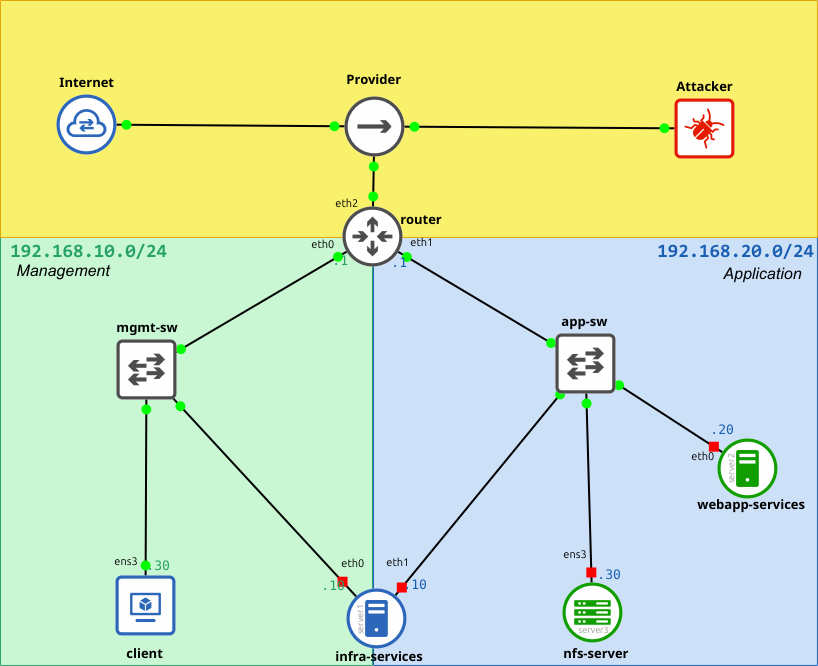

# GNS3 Lab for LFCS

## Description

This GNS3 lab was designed to test my knowledge in preparation for the Linux Foundation Certified System Administrator (LFCS) exam. It provides a practical environment that helped me to prepare for the exam.

## Requirements

- **Host**: Linux with GNS3 and QEMU installed, or Windows or MacOS with GNS3 VM Image
- **CPU**: Multicore CPU (ie. Intel i5/i or Ryzen 5)
- **RAM**: 8GiB minimum
- **DISK**: 40GiB available space

## Schema

## Resources

- **[Overview and Guidelines](GNS3%20Lab%20for%20LFCS%20-%20Overview%20and%20Guidelines.md)**
- **[Preparation](GNS3%20Lab%20for%20LFCS%20-%20Preparation.md)**
- **[Questions](GNS3%20Lab%20for%20LFCS%20-%20Questions.md)**
- **[Questions and Solutions]("./GNS3%20Lab%20for%20LFCS%20-%20Questions%20andvSolutions.md")**

## Quick Setup
For those who prefer a quick setup, the GNS3 project is available in portable format via the following links. There are two versions:

- [LFCS-GNS3-Portable-NoImages](https://mega.nz/folder/edd2GKia#8TYTBFtv_aiHL_fJr9XBOg): Contains the complete project without the qcow images.
- [LFCS-GNS3-Portable-Full](https://mega.nz/folder/rIFEwYrY#AYieH6XuZ5KTPSBEH7gqlA): Contains the complete project, including the qcow images.

Both versions are compressed in 7zip format and split into 1 GiB archive files.

## Contributing

Contributions are welcome! If you have suggestions, improvements, or find issues, please submit a pull request or open an issue.  This is a hobbyist project, and responses to issues or pull requests may be delayed as they will be addressed in my spare time. Thank you for your understanding.
